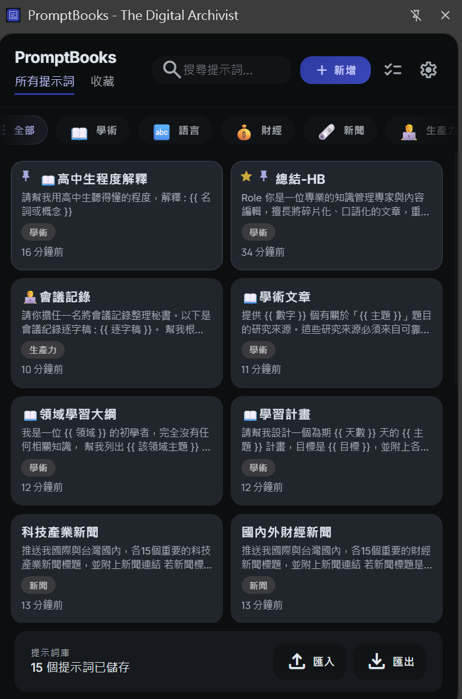
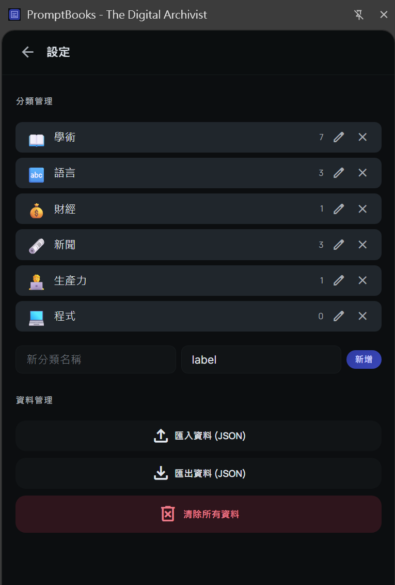

# PromptBooks

🚀 **PromptBooks** 是一款專為 AI 使用者設計的 Chrome 擴充套件，讓你能夠輕鬆儲存、管理並快速取用常用的 AI 提示詞（Prompts）。無論你是日常工作需要反覆輸入相似指令，還是想要建立屬於自己的提示詞資料庫，PromptBooks 都能大幅提升你的效率！

📝 主要特色：
- 支援新增、編輯、刪除提示詞，讓你隨時調整內容
- 分類與標籤功能，協助你有條理地管理大量提示詞
- 內建搜尋與篩選，快速找到所需內容
- 一鍵複製提示詞到剪貼簿，貼上更方便
- 支援 JSON 匯出/匯入，輕鬆備份與分享

🔒 資料儲存於 Chrome Storage，跨裝置自動同步，安全又便利

🎯 適用對象：
不論你是 AI 工程師、內容創作者、行銷人員，還是日常需要大量與 AI 工具互動的使用者，PromptBooks 都能成為你的最佳助手。讓你專注於創作與思考，重複性操作交給工具來搞定！

💡 立即安裝 PromptBooks，開啟高效 AI 工作流程，讓靈感與生產力無限延伸！
